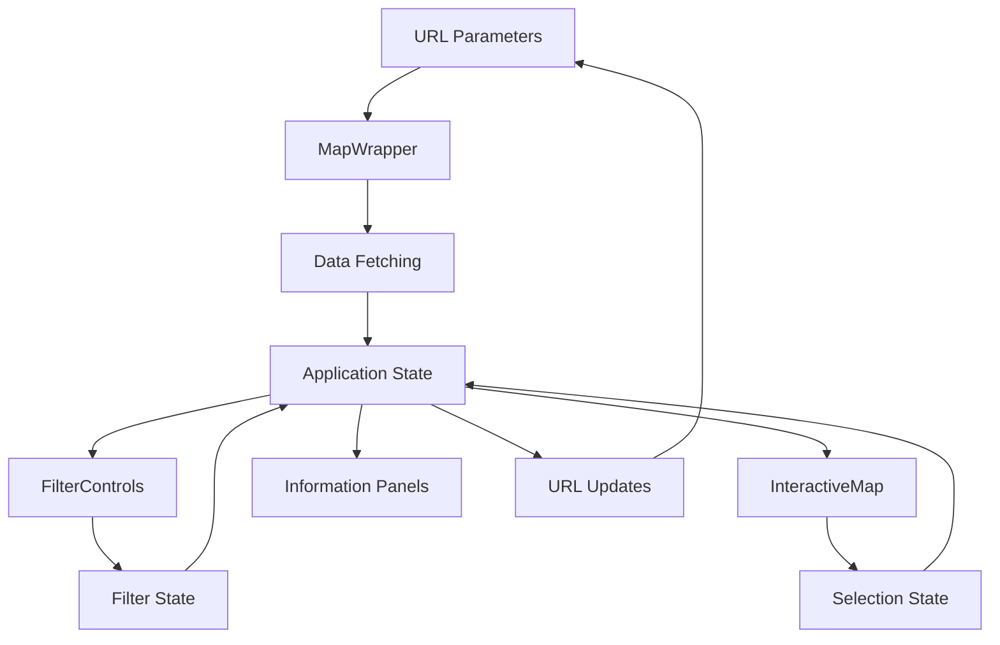

# Interactive Texas Data Centers Map - Architecture

This document outlines the architecture for the Interactive Texas Data Centers Map application, a visualization tool for exploring data centers across Central Texas.

## Overview

The Interactive Texas Data Centers Map is a web application that visualizes data centers in Central Texas (Austin, San Antonio, and Waco). It provides interactive features for exploring data centers by region, type, capacity, and status, along with comparative analysis between regions.

## Goals

- Create an engaging, interactive visualization of data centers across Central Texas
- Provide filtering capabilities to explore data by different criteria
- Enable detailed information display for specific data centers and regions
- Support comparative analysis between different regions
- Ensure responsive design for all device sizes
- Implement URL parameter handling for deep linking and sharing

## Application Structure

### Directory Structure

```
interactive-texas-data-centers-map/
├── app/
│   └── apps/
│       └── interactive-texas-data-centers-map/
│           └── page.jsx             # Page component with metadata
├── src/
│   └── components/
│       └── mini-apps/
│           └── interactive-texas-data-centers-map/
│               ├── MapWrapper.jsx   # Client-side wrapper
│               ├── MapLayout.jsx    # Main layout component
│               ├── FilterControls.jsx # Filtering UI
│               └── charts/
│                   ├── InteractiveMap.jsx # Map visualization
│                   ├── CapacityChart.jsx  # Capacity analysis
│                   ├── ComparisonChart.jsx # Region comparison
│                   └── SegmentationChart.jsx # Market segmentation
└── public/
    └── data/
        └── interactive-texas-data-centers-map/
            ├── data-centers.json    # Data center information
            ├── regions.json         # Region metadata
            └── market-segments.json # Market segment data
```

### Component Architecture


#### Core Components

1. **Page Component** (page.jsx)
   - Entry point for the application
   - Contains metadata for SEO
   - Dynamically imports the MapWrapper component

2. **MapWrapper** (MapWrapper.jsx)
   - Client-side entry point with `use client` directive
   - Manages application state
   - Handles data fetching
   - Processes URL parameters
   - Updates URL based on user interactions

3. **MapLayout** (MapLayout.jsx)
   - Main layout component
   - Arranges UI sections
   - Manages responsive layout
   - Contains navigation between sections

4. **InteractiveMap** (charts/InteractiveMap.jsx)
   - Renders the GeoJSON map
   - Handles zoom and pan interactions
   - Displays data center markers
   - Manages region highlighting
   - Shows tooltips on hover

5. **FilterControls** (FilterControls.jsx)
   - Provides UI for filtering data
   - Includes region selection
   - Supports data center type filtering
   - Offers capacity range selection
   - Allows status filtering

6. **Information Panels**
   - Display detailed information about selected items
   - Show regional statistics
   - Present data center details
   - Provide comparison metrics

### Data Flow



### Interaction Patterns

1. **Map Navigation**
   - Zoom in/out using buttons or scroll wheel
   - Pan by dragging
   - Click on regions to select them
   - Click on data center markers for details

2. **Filtering**
   - Select regions from dropdown
   - Choose data center types from checkboxes
   - Adjust capacity range with slider
   - Toggle status options

3. **Information Display**
   - Hover over data centers for tooltip information
   - Click on data centers for detailed panel
   - Select regions to see regional statistics
   - Navigate between chart sections for different analyses

4. **URL Parameter Handling**
   - Deep linking to specific views
   - Bookmark and sharing support
   - State persistence across page loads

## Technical Specifications

### Libraries and Dependencies

- **react-simple-maps**: For rendering GeoJSON data
- **framer-motion**: For animations and transitions
- **Next.js**: For routing and server-side rendering
- **TailwindCSS**: For responsive styling

### Performance Considerations

- Client-side rendering to avoid SSR issues with mapping libraries
- Data fetching with SWR for efficient caching
- Optimized filtering operations
- Debounced URL updates
- Lazy-loaded chart components

### Accessibility Features

- Keyboard navigation for all interactive elements
- Screen reader support for map data
- ARIA labels and roles
- Sufficient color contrast
- Alternative text for visual data

### SEO Optimization

- Proper metadata for the page component
- Structured data for search engines
- Social media sharing metadata
- Semantic HTML structure

## URL Parameters

The application supports the following URL parameters:

- `section`: Highlights a specific section (map, capacity, comparison, segmentation)
- `region`: Pre-selects a specific region (austin, san-antonio, waco)
- `type`: Pre-filters by a specific data center type (hyperscale, colocation, edge)
- `center`: Centers the map on specific coordinates (format: lat,lng)
- `zoom`: Sets the initial zoom level of the map (1-10)

Example:
```
/apps/interactive-texas-data-centers-map?section=map&region=austin&type=hyperscale&center=30.2672,-97.7431&zoom=7
```

## Implementation Phases

1. **Phase 1: Core Map Visualization**
   - Set up project structure
   - Create data files
   - Implement basic map component
   - Add data center markers

2. **Phase 2: Filtering and Interaction**
   - Implement filter controls
   - Add region selection
   - Create data center selection
   - Develop filtering logic

3. **Phase 3: Information Display**
   - Create information panels
   - Add tooltips
   - Implement regional statistics
   - Develop data center details

4. **Phase 4: Advanced Features**
   - Add comparison charts
   - Implement market segmentation
   - Create capacity analysis
   - Add animations and transitions

5. **Phase 5: URL and Routing**
   - Implement URL parameter handling
   - Add deep linking
   - Create history management
   - Develop section navigation

6. **Phase 6: Testing and Optimization**
   - Test functionality
   - Verify responsiveness
   - Optimize performance
   - Ensure accessibility

## Conclusion

This architecture provides a comprehensive plan for implementing the Interactive Texas Data Centers Map. By following this design, developers can create a robust, user-friendly application that effectively visualizes data centers across Central Texas and provides valuable insights into regional trends and comparisons.