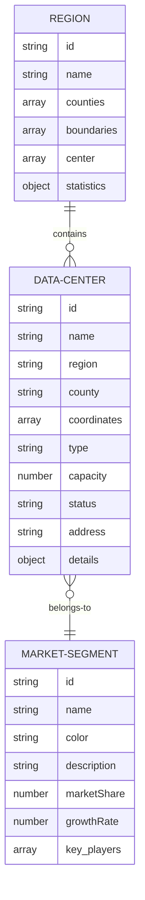

# Interactive Texas Data Centers Map - Data Model

This document specifies the data models for the Interactive Texas Data Centers Map application, including the structure of data center information, region metadata, and market segment data.

## Overview

The application relies on three primary data structures:

1. **Data Centers**: Information about individual data centers
2. **Regions**: Metadata about geographic regions (Austin, San Antonio, Waco)
3. **Market Segments**: Information about different market segments in the data center industry

These data structures are stored as JSON files in the public directory and loaded at runtime.

## Data Center Model

Data centers are represented as objects with the following properties:

```json
{
  "id": "unique-id",
  "name": "Data Center Name",
  "region": "Region Name",
  "county": "County Name",
  "coordinates": [longitude, latitude],
  "type": "Hyperscale|Colocation|Edge",
  "capacity": capacityInMW,
  "status": "Operational|Under Construction|Planned",
  "address": "Address",
  "details": {
    "description": "Description",
    "established": year,
    "powerCapacity": "Power capacity",
    "cooling": "Cooling details",
    "certifications": ["Cert1", "Cert2"],
    "expansionPlans": "Expansion plans"
  }
}
```

### Field Descriptions

| Field | Type | Description |
|-------|------|-------------|
| id | String | Unique identifier for the data center |
| name | String | Name of the data center |
| region | String | Region where the data center is located (Austin, San Antonio, Waco) |
| county | String | County where the data center is located |
| coordinates | Array | [longitude, latitude] coordinates for map placement |
| type | String | Type of data center (Hyperscale, Colocation, Edge) |
| capacity | Number | Power capacity in megawatts (MW) |
| status | String | Current status (Operational, Under Construction, Planned) |
| address | String | Physical address of the data center |
| details | Object | Additional details about the data center |

### Example Data Center

```json
{
  "id": "google-austin-1",
  "name": "Google Austin Data Center",
  "region": "Austin",
  "county": "Travis",
  "coordinates": [-97.7431, 30.2672],
  "type": "Hyperscale",
  "capacity": 250,
  "status": "Operational",
  "address": "9321 East Ben White Blvd, Austin, TX 78741",
  "details": {
    "description": "Google's first Texas data center, supporting cloud services across the region",
    "established": 2016,
    "powerCapacity": "250 MW with 100% renewable energy",
    "cooling": "Advanced free cooling systems with efficient water usage",
    "certifications": ["LEED Gold", "ISO 27001", "ENERGY STAR"],
    "expansionPlans": "Planned 100 MW expansion by 2026"
  }
}
```

## Region Model

Regions are represented as objects with the following properties:

```json
{
  "id": "region-id",
  "name": "Region Name",
  "counties": ["County1", "County2"],
  "boundaries": [[long1, lat1], [long2, lat2], ...],
  "center": [longitude, latitude],
  "statistics": {
    "totalDataCenters": count,
    "totalCapacity": capacityInMW,
    "growthRate": percentageValue,
    "powerAvailability": "High|Medium|Low",
    "landCost": "$/sqft",
    "incentives": ["Incentive1", "Incentive2"]
  }
}
```

### Field Descriptions

| Field | Type | Description |
|-------|------|-------------|
| id | String | Unique identifier for the region |
| name | String | Name of the region |
| counties | Array | List of counties in the region |
| boundaries | Array | Array of [longitude, latitude] coordinates defining the region boundary |
| center | Array | [longitude, latitude] coordinates for the region center |
| statistics | Object | Statistical information about the region |

### Example Region

```json
{
  "id": "austin",
  "name": "Austin",
  "counties": ["Travis", "Williamson", "Hays"],
  "boundaries": [
    [-97.9589, 30.4277],
    [-97.9132, 30.2984],
    [-97.7788, 30.1901],
    [-97.6526, 30.2211],
    [-97.6113, 30.3427],
    [-97.7018, 30.4310],
    [-97.9589, 30.4277]
  ],
  "center": [-97.7431, 30.2672],
  "statistics": {
    "totalDataCenters": 15,
    "totalCapacity": 750,
    "growthRate": 35.5,
    "powerAvailability": "Medium",
    "landCost": "2.75",
    "incentives": [
      "Property tax abatements up to 75%",
      "Expedited permitting",
      "Workforce development programs"
    ]
  }
}
```

## Market Segment Model

Market segments are represented as objects with the following properties:

```json
{
  "id": "segment-id",
  "name": "Segment Name",
  "color": "#hexColor",
  "description": "Segment Description",
  "marketShare": percentageValue,
  "growthRate": percentageValue,
  "key_players": ["Company1", "Company2"]
}
```

### Field Descriptions

| Field | Type | Description |
|-------|------|-------------|
| id | String | Unique identifier for the segment |
| name | String | Name of the market segment |
| color | String | Hex color code for visualization |
| description | String | Description of the market segment |
| marketShare | Number | Current market share percentage |
| growthRate | Number | Annual growth rate percentage |
| key_players | Array | List of key companies in this segment |

### Example Market Segment

```json
{
  "id": "hyperscale",
  "name": "Hyperscale",
  "color": "#4285F4",
  "description": "Large-scale data centers operated by major cloud providers and tech companies",
  "marketShare": 65.3,
  "growthRate": 42.7,
  "key_players": [
    "Google",
    "Microsoft",
    "Amazon Web Services",
    "Meta",
    "Apple"
  ]
}
```

## Data Relationships

The relationships between these data models are as follows:



## Data Extraction and Preparation

The data for this application will be extracted from the blog post content in `react-three-next/content/blog/central-texas-data-centers-2025.md` and structured according to these models. The extraction process involves:

1. Identifying data centers mentioned in the blog post
2. Determining their locations, types, and capacities
3. Researching additional details as needed
4. Formatting the data according to the specified models
5. Creating the JSON files in the appropriate directory

## Data Files

The data will be stored in the following files:

- `public/data/interactive-texas-data-centers-map/data-centers.json`
- `public/data/interactive-texas-data-centers-map/regions.json`
- `public/data/interactive-texas-data-centers-map/market-segments.json`

## Data Maintenance

To update the data in the future:

1. Edit the appropriate JSON file
2. Add new entries or modify existing ones
3. Ensure all required fields are present
4. Maintain consistent formatting
5. Test the application to verify data loading

## Conclusion

This data model provides a structured approach to representing data centers, regions, and market segments for the Interactive Texas Data Centers Map application. By following this model, the application can effectively visualize and analyze the data center landscape across Central Texas.